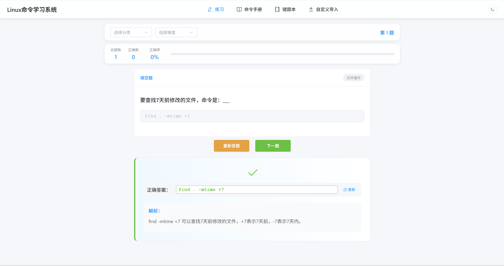
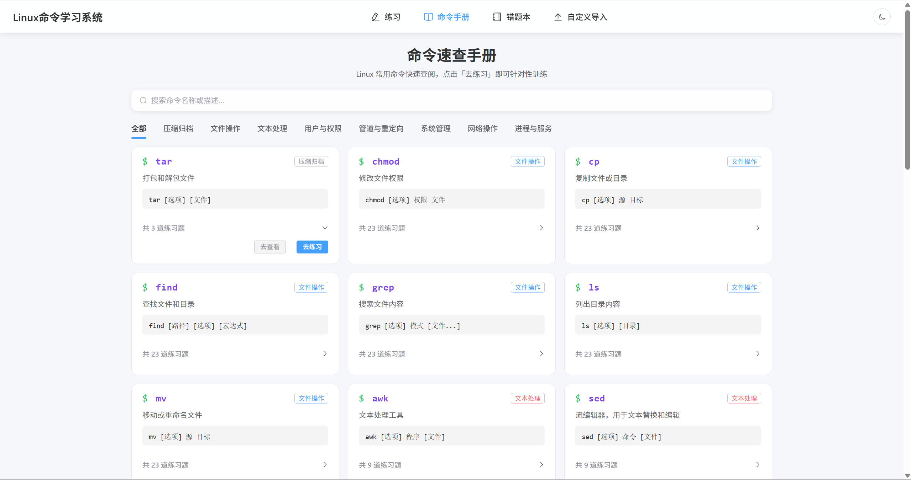
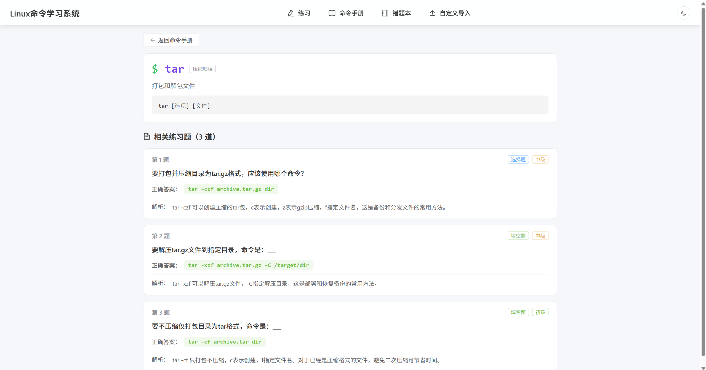
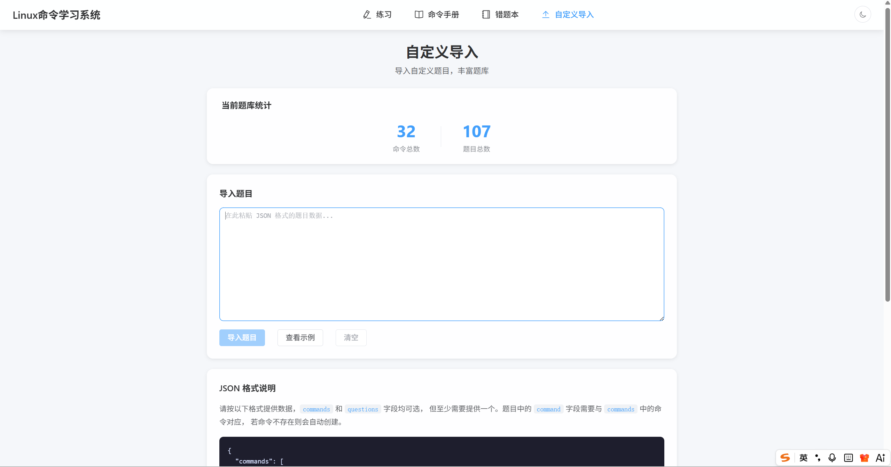

<h1 align="center">Linux Practice - Linux 命令学习系统</h1>

<p align="center">
  <strong>通过刷题与查阅掌握 Linux 常用命令，纯前端、零后端、开箱即用</strong>
</p>

<p align="center">
  
  
  
  
  
</p>

---

## 简介

Linux Practice 是一个基于 Vue 3 的 Linux 命令学习工具，帮助开发者通过刷题、查阅命令手册和错题回顾等方式，在反复练习中掌握日常工作中最常用的 Linux 命令。

项目使用 sql.js 在浏览器端运行 SQLite 数据库，无需后端服务器，纯前端运行，开箱即用。

## 功能特点

- **练习模式**：选择题 + 填空题双题型，随机出题，即时反馈
- **命令手册**：按分类浏览所有命令，支持搜索，一键查看详情或去练习
- **命令详情**：查看单个命令的用法、描述及相关练习题与解析
- **错题本**：自动记录答错的题目，支持重新练习和逐题复习
- **自定义导入**：通过 JSON 导入自定义命令和题目，扩展题库
- **智能判卷**：大小写不敏感、空格容错、参数顺序容错（如 `-rn` 与 `-r -n` 等效）
- **学习统计**：实时展示总题数、正确数、正确率
- **暗色主题**：支持一键切换明暗主题
- **纯前端运行**：无需后端，可部署到 GitHub Pages / Vercel 等任意静态托管

## 界面预览

### 练习页面



### 命令手册



### 命令详情



### 自定义导入



## 涵盖的命令

| 分类 | 命令 |
|------|------|
| 文件操作 | `ls` `find` `grep` `chmod` `cp` `mv` |
| 系统管理 | `ps` `top` `df` `du` `kill` |
| 网络操作 | `curl` `wget` `netstat` |
| 文本处理 | `sed` `awk` `sort` |
| 压缩归档 | `tar` |

## 快速开始

### 环境要求

- Node.js >= 16
- npm / pnpm / yarn

### 安装与运行

```bash
# 克隆项目
git clone https://github.com/<your-username>/LinuxPractice.git
cd LinuxPractice

# 安装依赖
npm install

# 启动开发服务器
npm run dev
```

浏览器会自动打开 `http://localhost:3000`。

### 构建生产版本

```bash
npm run build
```

## 使用说明

1. **练习**：打开网站后系统自动加载一道随机题目，选择题点选选项，填空题输入命令，点击「提交答案」或按 `Enter` 键提交，查看结果与解析后继续下一题。
2. **命令手册**：浏览或搜索命令，点击卡片展开后可「去查看」命令详情或「去练习」该分类题目。
3. **命令详情**：查看命令的用法、描述以及所有相关练习题和正确答案。
4. **错题本**：自动收集练习中答错的题目，支持重新练习和移除已掌握的题目。
5. **自定义导入**：按指定 JSON 格式导入自定义命令和题目，扩展个人题库。
